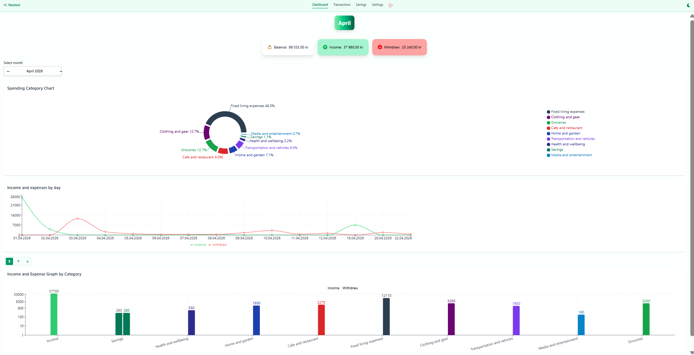
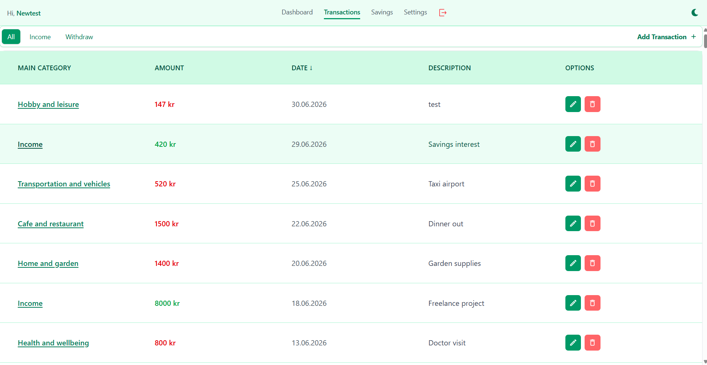
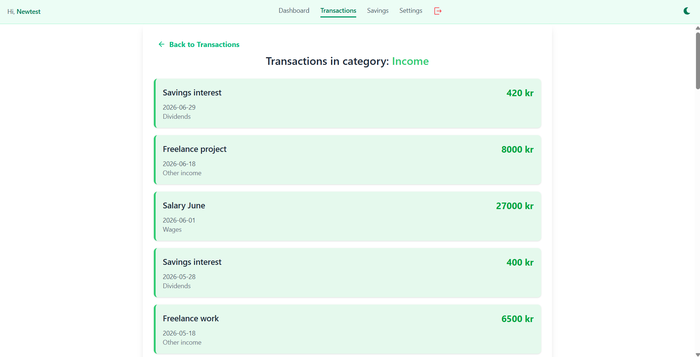
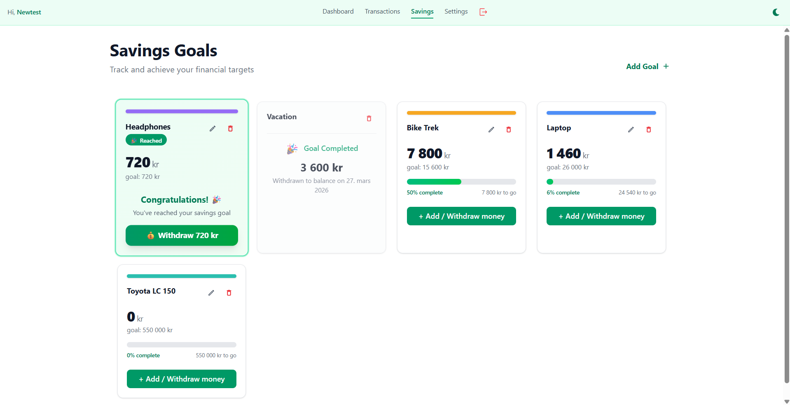
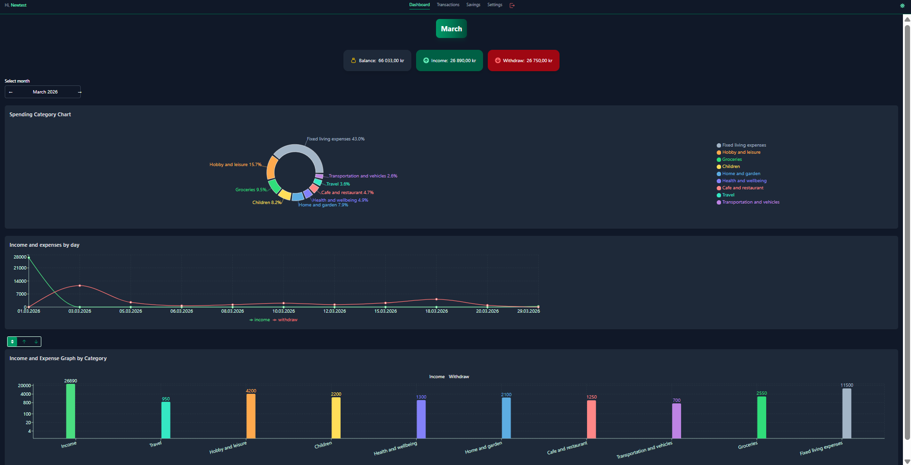

# 💰 Budget Allright v2

A clean and modern personal finance tracking application built with **React + TypeScript**, **Vite**, **Tailwind CSS**, and **Supabase**.

Manage your transactions, track savings goals, and visualize your financial health with beautiful charts.

🌍 [Live Demo](https://budget-allright-v2.netlify.app/) | 📂 [Repo](https://github.com/Zmax-17/budget-allright-v2)

---

## ✨ Features

- 🔐 Secure authentication with Supabase Auth
- 💸 Full transaction CRUD (income & expenses)
- 📊 Interactive dashboard with charts and balance overview
- 📂 Categories and subcategories with drill-down
- 🎯 Savings goals with progress tracking
- 📅 Flexible month picker and date filtering
- 🌗 Dark / Light theme with persistence
- 🎨 **Responsive UI** powered by Tailwind CSS

---

## 🛠️ Tech Stack

### Frontend

- **React 18** + **TypeScript**
- **Vite** - build tool
- **Tailwind CSS** - styling
- **TanStack Query (React Query)** - data fetching & caching
- **React Context** (state management)
- **Recharts** - charts
- **React Hook Form** - forms
- **date-fns** - date utilities

### Backend

- **Supabase** (PostgreSQL + Authentication + Storage)

### Other

- **React Hot Toast** - notifications
- **React Icons** - icons
- **ESLint + Prettier** - code quality

---

## 📸 Screenshots

### Dashboard



### Transactions




### Savings Goals



### Dark Mode



---

---

## 🚀 Quick Start

### 1. Clone the repository

```bash
git clone https://github.com/Zmax-17/budget-allright-v2.git
cd budget-allright
```

### 2. Install dependencies

      npm install

### 3. Set up environment variables (.env):

      VITE_SUPABASE_URL=your-supabase-url
      VITE_SUPABASE_ANON_KEY=your-supabase-anon-key

### 4. Run the app:

      bash
      npm run dev -->

### 5. Demo Account

---

To quickly try out the app without signing up, use the demo account:

**Email:** `demo@budgetallright.com`  
**Password:** `demo1234`

Demo data uploading is also available in the app settings.

---

📌 Current Status

Authentication
Transactions (CRUD + filtering)
Dashboard & Charts
Savings Goals (basic)
Dark/Light Theme
Advanced savings analytics (planned)

🧹 Code Quality

Full TypeScript migration
ESLint + Prettier configured
React Error Boundary
Proper error handling and toast notifications

📄 License
This project is open source under the MIT License.
